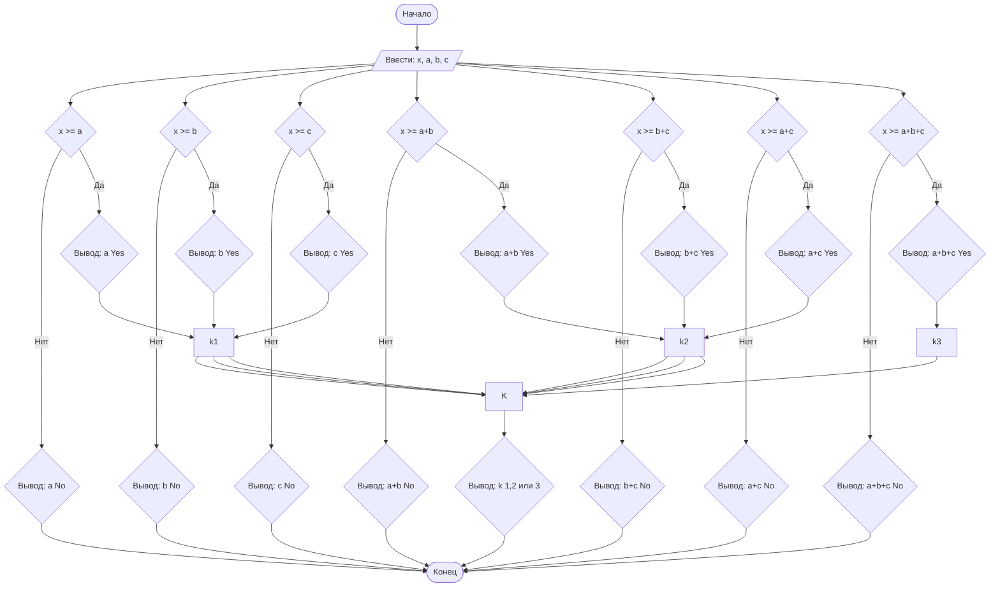

## Отчет по лабораторной работе № 1

#### № группы: `ПМ-2602`

#### Выполнил: `Полухин Дмитрий Владимирович`

#### Вариант: `18`

### Cодержание:

- [Постановка задачи](#1-постановка-задачи)
- [Входные и выходные данные](#2-входные-и-выходные-данные)
- [Выбор структуры данных](#3-выбор-структуры-данных)
- [Алгоритм](#4-алгоритм)
- [Программа](#5-программа)
- [Анализ правильности решения](#6-анализ-правильности-решения)

### 1. Постановка задачи

> В лифт с грузоподъёмностью Х пытаются загрузить грузы весом А, В, С.
> Проверить, какие из грузов могут быть загружены в лифт без превышения допустимой массы,и определить, сколько грузов можно поместить в лифт.
> На вход программы подаются натуральные числа Х, А, В, С.

Данную задача решается рассмотрением всех возможных комбинаций грузов и возможность лифта их выдержать.
Всего надо рассмотреть `3!=6` случаев:
i. `X>=A`
ii.`X>=B`
iii.`X>=C`
iv.`X>=A+B`
v.`X>=B+C`
vi.`X>=A+C`
vii.`X>=A+B+C`


### 2. Входные и выходные данные

#### Данные на вход

На вход программа должна получать 4 числа, при этом в условии не сказано, к какому множеству
принадлежать получаемые числа, поэтому будем считать их вещественными (>0 так как масса отрицательной быть не может). Верхняя и нижняя границы получаемых
чисел не даны так что нижней буду считать 0 .

|             | Тип                | min значение    |
|-------------|--------------------|-----------------|
| X (Число 1) | Вещественное число | 0               | 
| A (Число 2) | Вещественное число | 0               | 
| B (Число 3) | Вещественное число | 0               | 
| C (Число 4) | Вещественное число | 0               | 

#### Данные на выход

Т.к. программа должна вывести какие грузы могут быть загружены в лифт, то на выход мы получим
7 ответов латиницей и один ответ который говорит максимальное количество грузов это целое число `k` от 0 до 3 .

|         | Тип                                | Min(1) значение |  Max(2) значение  |
|---------|------------------------------------|-----------------|-------------------|
| Число 1 | Ответ на вопрос латиницей          |   A Yes         |    A No           |
| Число 2 | Ответ на вопрос латиницей          |   B Yes         |    B No           |
| Число 3 | Ответ на вопрос латиницей          |   C Yes         |    C No           |
| Число 4 | Ответ на вопрос латиницей          |   A+B Yes       |    A+B No         |
| Число 5 | Ответ на вопрос латиницей          |   B+C Yes       |    B+C No         |
| Число 6 | Ответ на вопрос латиницей          |   A+C Yes       |    A+C No         |
| Число 7 | Ответ на вопрос латиницей          |   A+B+C Yes     |    A+B+C No       |
| Число 8 | Целое число `k`                    |   0             |    3              |

### 3. Выбор структуры данных

Программа получает 4 вещественных числа,>=0. Поэтому для их хранения
можно выделить 4 переменных (`x`, `a`, `b` и `c`) типа `double`.

|             | название переменной | Тип (в Java) | 
|-------------|---------------------|--------------|
| X (Число 1) | `x`                 | `double`     |
| A (Число 2) | `a`                 | `double`     | 
| B (Число 3) | `b`                 | `double`     |
| C (Число 4) | `c`                 | `double`     | 

Для вывода результата необязательно его хранить в отдельной переменной.

### 4. Алгоритм

#### Алгоритм выполнения программы:

1. **Ввод данных:**  
   Программа считывает четыре вещественных числа, обозначенные как `x`, `a`, `b` и `c`.

2. **Сравнение чисел    :**  
   Программа сравнивает значения `a` ,`b`, `c` и их комбинации с `x`. Если `x` больше или равно числу, программа выводит что лифт может поднять этот груз(ы) и
   заменяет максимальное число грузов(мы можем так сделать так как количество грузов возрастает или остается прежним после каждого проверенного случая).
   Если же Если `x` меньше числа то программа выводит что лифт не может поднять груз(ы)

3. **Вывод результата:**  
   На экран выводится 7 ответов с весом груза(ов) и может ли их поднять лифт, а также ответ на количество грузов `k` которых может выдержать лифт.

#### Блок-схема



### 5. Программа

```java
import java.io.PrintStream;
import java.util.Scanner;

public class Main {
    public static Scanner in = new Scanner(System.in);
    public static PrintStream out = System.out;

    public static void main(String[] args) {

        double x = in.nextDouble();
        double a = in.nextDouble();
        double b = in.nextDouble();
        double c = in.nextDouble();
        int k = 0;

        // Проверяем груз A
        if (x >= a) {
            out.println(a + " Yes");
            k = 1;
        } else {
            out.println(a + " No");
        }

        // Проверяем груз B
        if (x >= b) {
            out.println(b + " Yes");
            k = 1;
        } else {
            out.println(b + " No");
        }

        // Проверяем груз C
        if (x >= c) {
            out.println(c + " Yes");
            k = 1;
        } else {
            out.println(c + " No");
        }

        // Проверяем A + B
        if (x >= a + b) {
            out.println(a + " + " + b + " Yes");
            k = 2;
        } else {
            out.println(a + " + " + b + " No");
        }

        // Проверяем B + C
        if (x >= b + c) {
            out.println(b + " + " + c + " Yes");
            k = 2;
        } else {
            out.println(b + " + " + c + " No");
        }

        // Проверяем A + C
        if (x >= a + c) {
            out.println(a + " + " + c + " Yes");
            k = 2;
        } else {
            out.println(a + " + " + c + " No");
        }

        // Проверяем A + B + C
        if (x >= a + b + c) {
            out.println(a + " + " + b + " + " + c + " Yes");
            k = 3;
        } else {
            out.println(a + " + " + b + " + " + c + " No");
        }

        out.println("Максимальное количество грузов: " + k);
    }
}
```

### 6. Анализ правильности решения

Программа работает корректно на всем множестве решений с учетом ограничений.

1. Тест на `X>=A+B+C`:

    - **Input**:
        ```
        100 30 40 10
        ```

    - **Output**:
        ```
        30.0 Yes
         40.0 Yes
         10.0 Yes
         30.0 + 40.0 Yes
         40.0 + 10.0 Yes
         30.0 + 10.0 Yes
         30.0 + 40.0 + 10.0 Yes
         Максимальное количество грузов: 3
        ```

2. Тест на `A>X`:

    - **Input**:
        ```
         100 110 40 10
        ```

    - **Output**:
        ```
         110.0 No
         40.0 Yes
         10.0 Yes
         110.0 + 40.0 No
         40.0 + 10.0 Yes
         110.0 + 10.0 No
         110.0 + 40.0 + 10.0 No
         Максимальное количество грузов: 2
        ```

3. Тест на `A+B>X`:

    - **Input**:
        ```
        100 60 70 10
        ```

    - **Output**:
        ```
        60.0 Yes
         70.0 Yes
         10.0 Yes
         60.0 + 70.0 No
         70.0 + 10.0 Yes
         60.0 + 10.0 Yes
         60.0 + 70.0 + 10.0 No
         Максимальное количество грузов: 2

        ```

4. Тест на `A = X`:

    - **Input**:
        ```
        100 100 20 70
        ```

    - **Output**:
        ```
        100.0 Yes
         20.0 Yes
         70.0 Yes
         100.0 + 20.0 No
         20.0 + 70.0 Yes
         100.0 + 70.0 No
         100.0 + 20.0 + 70.0 No
         Максимальное количество грузов: 2

        ```
